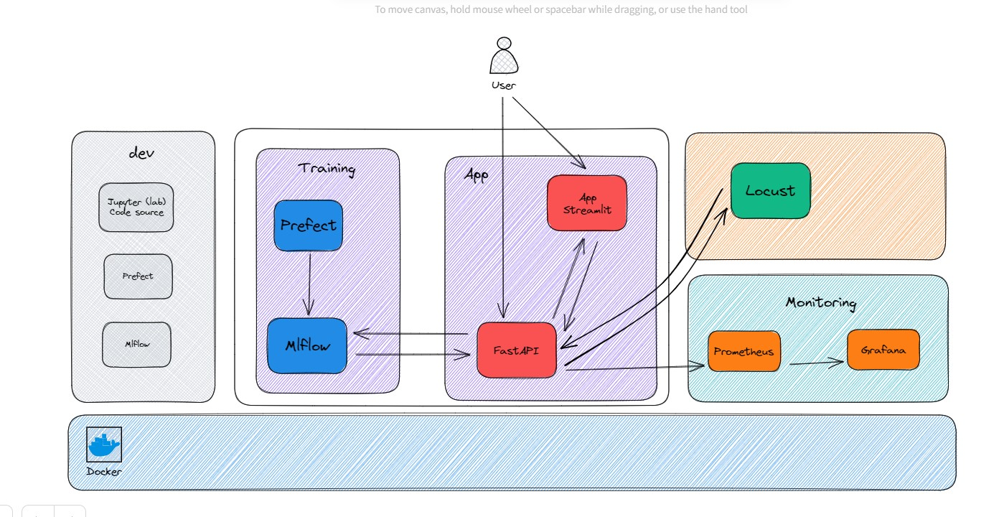

# 5MLDE - Group 1 - Spam Email classification

This repo contains the group work done as part of the 5MLDE course at Supinfo School. It is about deploying machine learning models on different platforms.

## Overview


## Prerequisites

- Docker:  [Docker website](https://www.docker.com).
- Docker Compose: [Docker Compose website](https://docs.docker.com/compose/install/).
- Visual Studio Code (Dev): [Visual Studio Code website](https://code.visualstudio.com).
- Remote - Containers extension (Dev):  [Visual Studio Code marketplace](https://marketplace.visualstudio.com/items?itemName=ms-vscode-remote.remote-containers).


## How to run the project 

Make sure the Bash script (`services.sh`) or the PowerShell script (`Services.ps1`) or (`Makefile`) is in the root folder of your project.

<details>
    <summary><b>Using `make` (Recommended)</b></summary>
    use git bash or bash shell command line
    to start
    <p><pre> make start-services</pre></p>
    To stop
    <p><pre> make stop-services</pre></p>
</details>
<details>
    <summary><b>For Linux/macOS users, run the Bash script</b></summary>
    To start
    <p><pre>chmod +x services.sh</pre></p>
    <p><pre>./services.sh start-services</pre></p>
    To stop
    <p><pre>./services.sh stop-services</pre></p>
</details>
<details>
    <summary><b>For Windows users, run the PowerShell script in PowerShell</b></summary>
    To start
    <p><pre>Set-ExecutionPolicy Bypass -Scope Process -Force</pre></p>
    <p><pre>.\Services.ps1 start-services</pre></p>
    To stop
    <p><pre>.\Services.ps1 stop-services</pre></p>
</details>

### Accessing the services

- The web app is available at: [http://localhost:8501](http://localhost:8501).
- The mlflow server is available at: [http://localhost:5000](http://localhost:5000).
- The prometheus server is available at: [http://localhost:9090](http://localhost:9090).
- The grafana server is available at: [http://localhost:3000](http://localhost:3000). The default username and password are `admin` and `admin`.
- The prefect server is available at: [http://localhost:8080](http://localhost:8080).
- The Locust server is available at: [http://localhost:8089](http://localhost:8089).
- The API Swagger is available at: [http://localhost:8086/docs](http://localhost:8086/docs).

### Create a model

1. On the prefect server, you can run th ModelTraining deployment flow to create a model.
2. You can then go to the mlflow server and check the model metrics.
3. On prefect server, run the Best Model Training Deployment flow to deploy the best model. Choose the version of the model you want to stage and deploy.
4. You can then go to the web app and test the model.

### Run the performance test

Go to the  locust address and run the performance test. You can change the number of users and the hatch rate.

### Monitoring

You can go to the prometheus server and check the metrics. You can also go to the grafana server and check the dashboards.

## Project structure

- `lab`: contains the lab work done during the course.
- `src` : contains the source code of the final project.

### Source code
In the `src` folder, you will find the following folders:

- `api`: contains the code of the API.
- `app`: contains the code of the web app.
- `mlflow`: contains the dockerfile to build the mlflow server.
- `monitoring`: contains the prometheus and grafana configuration files.
- `perfomance`: contains the code of the performance test.
- `training`: contains the code of the training pipeline.

### Lab

If you want to run the lab work. You can reopen the project in a container and run the `SpamEmailDraft.ipynb` notebook. And for the mlflow and prefect server, you can run the following commands:

```bash
pyhon init_mlflow.py
python init_orion.py
```


## License

This project is licensed under the [MIT License](LICENSE).

