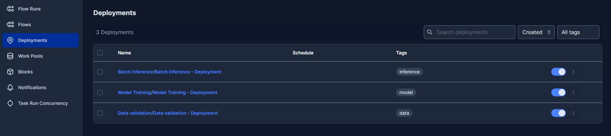

# 5MLDE - Group 1 - Spam Email classification

This repo contains the group work done as part of the 5MLDE course at Supinfo School. It is about deploying machine learning models on different platforms.

## Getting Started

These instructions will help you set up the development environment for Jupyter and MLflow using Docker Compose.

### Prerequisites

- Docker: Install Docker on your machine by following the instructions on the [Docker website](https://www.docker.com).
- Docker Compose: Install Docker Compose by following the instructions on the [Docker Compose website](https://docs.docker.com/compose/install/).
- Visual Studio Code: Install Visual Studio Code by following the instructions on the [Visual Studio Code website](https://code.visualstudio.com).
- Remote - Containers extension: Install the "Remote - Containers" extension for Visual Studio Code from the [Visual Studio Code marketplace](https://marketplace.visualstudio.com/items?itemName=ms-vscode-remote.remote-containers).

⛔ Do not run the both environments at the same time as they use the same ports.

### Setting up the development environment

1. Clone this repository: git clone https://github.com/hadramet/5mlde.git
2. Open the project folder in Visual Studio Code.
3. Click the "Reopen in Container" option in the bottom-left corner of the window. If you don't see the option, press `F1` and type "Remote-Containers: Reopen in Container" in the command palette. This will launch the Jupyter container using the Docker Compose configuration.
4. Visual Studio Code will open a new window with the project folder mounted in the container.
5. Run the script `python init_orion.py` and `python init_mlflow.py` each in a separate terminal to initialize the Orion Prefec and MLflow servers.
6. Open the Jupyter notebook `SpamEmailDraft.ipynb` and run the cells to train the model and log it to MLflow.

### Setting up the production environment

1. Navigate to the `src` folder.
2. Run `docker-compose up -d`. This will build the infrastructure and create two containers: `training` for running Prefect deployment orchestration and `mlflow` for the model registry.
3. Run `docker-compose down --volumes` to stop the containers and remove the volumes.

## Orchestrating the training pipeline

You can use Prefect to orchestrate the training pipeline. The Prefect server is available at http://localhost:4200.

Navigate to deployement menu

You can see the list of deployments, and run a new one. We reommend starting with the `DataValidation` deployment. This will first download the data, then validate it. If the validation fails, the deployment will stop.

## Mlflow tracking

We use MLflow to track the training of our models. The MLflow server is available at http://localhost:5000. Email spam  is the only experiments we have trained so far. You can see the list of runs, and the metrics and parameters associated with each run.

### Staging in production

TODO

For both environments, you can access the prefec UI at http://localhost:4200 and the mlflow UI at http://localhost:5000.

## License

This project is licensed under the [MIT License](LICENSE).
